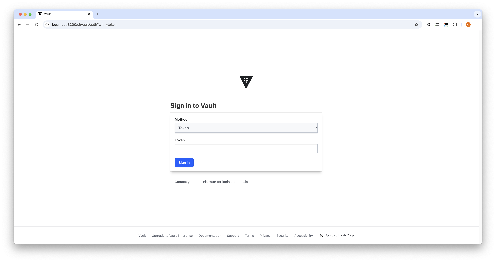

# Vault on Kubernetes Testing Setup

This guide demonstrates how to set up HashiCorp Vault on a local Kubernetes cluster ([kind](https://kind.sigs.k8s.io/docs/user/quick-start/#installation)) with secret injection capabilities.

Please note that this setup enables Vault in dev mode, which is primarily for testing and development. In dev mode:
* Vault runs in-memory only (no persistent storage).
* Vault automatically initializes and unseals itself.
* It prints a root token to the logs.

Dev mode is not secure and should never be used in production. In production, you should disable this setting and configure a storage backend (e.g., Consul, Raft, DynamoDB, etc.).

## Prerequisites

Before you begin, make sure you have the following tools installed:

- [kind](https://kind.sigs.k8s.io/docs/user/quick-start/#installation) - for creating a local Kubernetes cluster
- [kubectl](https://kubernetes.io/docs/tasks/tools/#kubectl) - for interacting with the Kubernetes cluster
- [Helm](https://helm.sh/docs/intro/install/) - for installing Vault
- [Vault CLI](https://developer.hashicorp.com/vault/downloads) - (optional) for local interaction with Vault

## Step-by-Step Setup

### 1. Create a Kind Cluster

```bash
kind create cluster --name hello-vault
```

### 2. Add HashiCorp Helm Repository

```bash
helm repo add hashicorp https://helm.releases.hashicorp.com
helm repo update
```

### 3. Create Vault Values File

Create a `values.yaml` file with the following content:

```yaml
server:
  dev:
    enabled: true
  service:
    type: ClusterIP

injector:
  enabled: true

ui:
  enabled: true
```

### 4. Install Vault in the vault Namespace

```bash
helm install vault hashicorp/vault -f values.yaml --namespace vault --create-namespace
```

### 5. Wait for Vault to be Ready

```bash
kubectl wait --for=condition=ready pod -l app.kubernetes.io/name=vault --timeout=90s -n vault
```

### 6. Create a Secret in Vault

We create a Secret called `my-app` with two key-value pairs:
```bash
kubectl exec -n vault vault-0 -- vault kv put secret/my-app clientId=myClientId clientToken=myClientToken
```

The key-value pairs:
* `clientId=myClientId`
* `clientToken=myClientToken`

### 7. Configure Vault Authentication

Create a policy for accessing the secret:

```bash
kubectl exec -n vault vault-0 -- /bin/sh -c 'vault policy write myapp-policy - << EOF
path "secret/data/my-app" {
  capabilities = ["read"]
}
path "secret/metadata/my-app" {
  capabilities = ["read"]
}
EOF'
```

Enable and configure Kubernetes authentication:

```bash
kubectl exec -n vault vault-0 -- /bin/sh -c 'vault auth enable kubernetes && \
vault write auth/kubernetes/config \
   kubernetes_host="https://$KUBERNETES_PORT_443_TCP_ADDR:443" \
   token_reviewer_jwt="$(cat /var/run/secrets/kubernetes.io/serviceaccount/token)" \
   kubernetes_ca_cert=@/var/run/secrets/kubernetes.io/serviceaccount/ca.crt \
   issuer="https://kubernetes.default.svc.cluster.local" && \
vault write auth/kubernetes/role/default \
   bound_service_account_names=default \
   bound_service_account_namespaces=default \
   policies=myapp-policy \
   ttl=24h'
```

What these commands do:
1. Enable the Kubernetes authentication method in Vault
   This allows Kubernetes service accounts to authenticate with Vault
2. Configure the Kubernetes auth method with the CA, JWT and issuer URI
3. Create a role named 'default' that maps Kubernetes service accounts to Vault policies

and in a nutshell they apply identity federation between Kubernetes and Vault.

### 8. Create a Test Pod

Create a file named `curl-pod.yaml` with the following content:

```yaml
apiVersion: v1
kind: Pod
metadata:
  name: curl-pod
  namespace: default
  annotations:
    vault.hashicorp.com/agent-inject: "true"
    vault.hashicorp.com/agent-inject-secret-myapp: "secret/data/my-app"
    vault.hashicorp.com/role: "default"
    vault.hashicorp.com/secret-volume-path: "/api-client"
    vault.hashicorp.com/agent-inject-secret-clientId: "secret/data/my-app"
    vault.hashicorp.com/agent-inject-secret-clientToken: "secret/data/my-app"
    vault.hashicorp.com/agent-inject-template-clientId: |
      {{- with secret "secret/data/my-app" -}}
      {{- .Data.data.clientId -}}
      {{- end -}}
    vault.hashicorp.com/agent-inject-template-clientToken: |
      {{- with secret "secret/data/my-app" -}}
      {{- .Data.data.clientToken -}}
      {{- end -}}
    vault.hashicorp.com/agent-inject-file-clientId: "clientId"
    vault.hashicorp.com/agent-inject-file-clientToken: "clientToken"
spec:
  containers:
  - name: curl
    image: curlimages/curl
    command: ["sleep"]
    args: ["infinity"]
```

Apply the Pod manifest:

```bash
kubectl apply -f curl-pod.yaml
```

### 9. Verify Secret Injection

Wait for the Pod to be ready:

```bash
kubectl wait --for=condition=ready pod/curl-pod -n default --timeout=90s
```

View the injected secrets:

```bash
kubectl exec -n default curl-pod -c curl -- cat /api-client/clientId
kubectl exec -n default curl-pod -c curl -- cat /api-client/clientToken
```

If all went well it should look like the following:

```bash
$ kubectl exec -n default curl-pod -c curl -- cat /api-client/clientId
myClientId
$ kubectl exec -n default curl-pod -c curl -- cat /api-client/clientToken
myClientToken
$
```

Notice the injected init container:
```bash
$ kubectl get pod curl-pod -o=jsonpath='{.spec.initContainers[0].name}'
vault-agent-init
$
```

And the sidecar container:
```bash
$ kubectl get pod curl-pod -o=jsonpath='{.spec.containers[*].name}'
curl vault-agent
$ kubectl get pod
NAME       READY   STATUS    RESTARTS   AGE
curl-pod   2/2     Running   0          5m9s
$
```

### 9. Access Vault from the host

First, expose the Vault Server port to the host:
```bash
kubectl port-forward -n vault svc/vault-ui 8200:8200
``` 
Then, on a separate shell, run:
```bash
export VAULT_ADDR="http://127.0.0.1:8200"
vault status
vault login
vault kv get secret/my-app
```

For example:
```bash
$ vault kv get secret/my-app
=== Secret Path ===
secret/data/my-app

======= Metadata =======
Key                Value
---                -----
created_time       2025-03-04T10:47:19.210476883Z
custom_metadata    <nil>
deletion_time      n/a
destroyed          false
version            1

======= Data =======
Key            Value
---            -----
clientId       myClientId
clientToken    myClientToken
$
```

### 10. (Non-hackers only) View the secrets in the UI

First, expose the Vault UI port to the host:
```bash
kubectl port-forward -n vault svc/vault-ui 8200:8200
``` 

Then open your browser at:

http://localhost:8200

You will be presented with the Vault Login page, use `root` as the token 🤫:


Then you will see the Vault Dashboard:


If you click on the `secret/` you will be able to see the secret that we have provisioned above:


## Cleanup

To delete the test environment:

```bash
kind delete cluster --name hello-vault
```

## Notes

- This setup uses Vault in dev mode, which is not suitable for production use
- The secrets are mounted at `/api-client/clientId` and `/api-client/clientToken` inside the Pod
- The setup uses the default service account in the default namespace
- The Vault Helm Chart is deployed to the `vault` namespace
- The ephemeral curl Pod is deployed to the `default` namespace

## Bonus - Identity Federation
In this sample we have created an **identity federation** between **Kubernetes** and **Vault**. Specifically:

1. The commands establish a trust relationship where Vault can verify the authenticity of Kubernetes service account tokens by:
* Configuring Vault with the Kubernetes API endpoint
* Providing Vault with the necessary credentials (token_reviewer_jwt) to validate service account tokens
* Setting up the CA certificate for secure communication
* Configuring the expected token issuer
2. The role creation (auth/kubernetes/role/default) sets up the authorization mapping:
* It maps the default service account from the default namespace to the Vault policy named 'myapp-policy'
* This means when a pod using the default service account authenticates to Vault, it will receive the permissions defined in myapp-policy
* The authentication is time-limited (24 hours) for security

This setup enables a secure authentication flow where:
1. Kubernetes pods can authenticate to Vault using their service account token
2. Vault validates these tokens against the Kubernetes API
3. Upon successful validation, Vault grants access based on the mapped policies
4. The access is automatically time-limited for security

This is a common pattern in cloud-native security architectures, allowing applications running in Kubernetes to securely access secrets stored in Vault without needing to manage separate credentials.